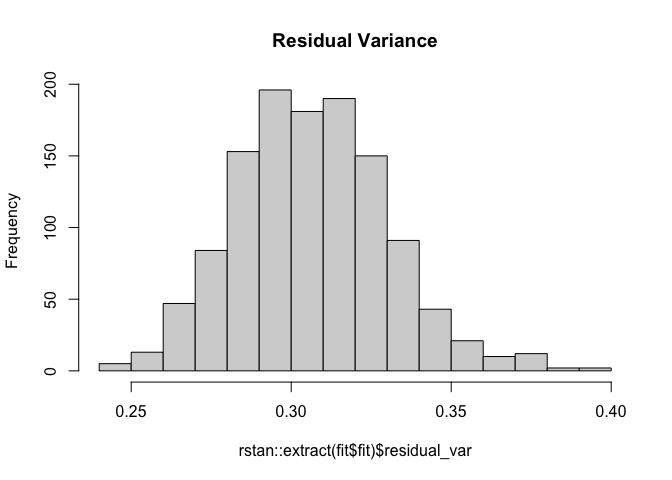
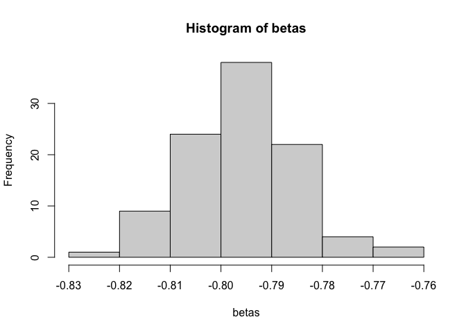

relcs
=====

What is this?
-------------

Random Effects Latent Change Score models.

Install
-------

Devel version from github

    install.packages("devtools")
    devtools::install_github("brandmaier/relcs")

    library("relcs")
    #> Loading required package: parallel
    #> Loading required package: MASS
    #> Loading required package: OpenMx
    #> OpenMx may run faster if it is compiled to take advantage of multiple cores.
    #> Loading required package: rstan
    #> Loading required package: StanHeaders
    #> Loading required package: ggplot2
    #> Warning: replacing previous import 'vctrs::data_frame' by 'tibble::data_frame'
    #> when loading 'dplyr'
    #> rstan (Version 2.19.3, GitRev: 2e1f913d3ca3)
    #> For execution on a local, multicore CPU with excess RAM we recommend calling
    #> options(mc.cores = parallel::detectCores()).
    #> To avoid recompilation of unchanged Stan programs, we recommend calling
    #> rstan_options(auto_write = TRUE)

How To Use
----------

### Simulation

Simulate 100 cases from a RELCS model:

    library(relcs)
    library(tidyverse)
    library(ggplot2)

    simulated_data <- simulateDataFromRELCS(N = 100, 
                                            num.obs = 5, 
                                            residualerrorvariance = .1,
                                            selffeedback.mean = .5,
                                            has.slope=FALSE)

Plot the first 20 simulated trajectories:

    simulated_data %>% 
      mutate(id=1:nrow(simulated_data)) %>% 
      filter(id < 20) %>%
      pivot_longer(-id) %>%
      ggplot(aes(x=name,y=value,group=id,color=factor(id)))+
      geom_line()+
      theme_minimal()+
      xlab("Time")+ylab("Value")+
      ggx::gg_("hide legend")
    #> Registered S3 method overwritten by 'sets':
    #>   method        from   
    #>   print.element ggplot2

### model fit

    fit <- fitRELCS(data = simulated_data, type="stan")
    #> Warning: There were 99 divergent transitions after warmup. Increasing adapt_delta above 0.8 may help. See
    #> http://mc-stan.org/misc/warnings.html#divergent-transitions-after-warmup
    #> Warning: There were 3 chains where the estimated Bayesian Fraction of Missing Information was low. See
    #> http://mc-stan.org/misc/warnings.html#bfmi-low
    #> Warning: Examine the pairs() plot to diagnose sampling problems
    #> Warning: The largest R-hat is 1.86, indicating chains have not mixed.
    #> Running the chains for more iterations may help. See
    #> http://mc-stan.org/misc/warnings.html#r-hat
    #> Warning: Bulk Effective Samples Size (ESS) is too low, indicating posterior means and medians may be unreliable.
    #> Running the chains for more iterations may help. See
    #> http://mc-stan.org/misc/warnings.html#bulk-ess
    #> Warning: Tail Effective Samples Size (ESS) is too low, indicating posterior variances and tail quantiles may be unreliable.
    #> Running the chains for more iterations may help. See
    #> http://mc-stan.org/misc/warnings.html#tail-ess

    fit$fit
    #> Inference for Stan model: f5c4092c36946657ffd2b8726c04f9d6.
    #> 3 chains, each with iter=600; warmup=200; thin=1; 
    #> post-warmup draws per chain=400, total post-warmup draws=1200.
    #> 
    #>                 mean se_mean    sd   2.5%    25%    50%    75%  97.5% n_eff
    #> residual_var    0.09    0.00  0.01   0.08   0.08   0.09   0.09   0.10   143
    #> self_fb_mu     -0.39    0.19  0.42  -1.29  -0.61  -0.37  -0.14   0.37     5
    #> self_fb_var     0.06    0.01  0.07   0.01   0.02   0.04   0.08   0.28    27
    #> intercept_mu    0.00    0.01  0.02  -0.04  -0.01   0.00   0.02   0.05    21
    #> intercept_var   0.00    0.00  0.01   0.00   0.00   0.00   0.01   0.02    10
    #> lp__          729.22   32.62 75.18 584.59 676.14 719.36 792.65 859.51     5
    #>               Rhat
    #> residual_var  1.04
    #> self_fb_mu    1.84
    #> self_fb_var   1.12
    #> intercept_mu  1.11
    #> intercept_var 1.21
    #> lp__          1.61
    #> 
    #> Samples were drawn using NUTS(diag_e) at Thu Mar 25 18:18:29 2021.
    #> For each parameter, n_eff is a crude measure of effective sample size,
    #> and Rhat is the potential scale reduction factor on split chains (at 
    #> convergence, Rhat=1).

### visually inspect model posteriors

    hist(rstan::extract(fit$fit)$residual_var,main = "Residual Variance")

 \#\#\#
Obtain individual beta estimates

    fit_with_beta <- fitRELCS(data = simulated_data, type="stan",beta.as.parameter = TRUE)
    #> recompiling to avoid crashing R session
    #> Warning: There were 29 divergent transitions after warmup. Increasing adapt_delta above 0.8 may help. See
    #> http://mc-stan.org/misc/warnings.html#divergent-transitions-after-warmup
    #> Warning: There were 3 chains where the estimated Bayesian Fraction of Missing Information was low. See
    #> http://mc-stan.org/misc/warnings.html#bfmi-low
    #> Warning: Examine the pairs() plot to diagnose sampling problems
    #> Warning: The largest R-hat is 2, indicating chains have not mixed.
    #> Running the chains for more iterations may help. See
    #> http://mc-stan.org/misc/warnings.html#r-hat
    #> Warning: Bulk Effective Samples Size (ESS) is too low, indicating posterior means and medians may be unreliable.
    #> Running the chains for more iterations may help. See
    #> http://mc-stan.org/misc/warnings.html#bulk-ess
    #> Warning: Tail Effective Samples Size (ESS) is too low, indicating posterior variances and tail quantiles may be unreliable.
    #> Running the chains for more iterations may help. See
    #> http://mc-stan.org/misc/warnings.html#tail-ess
    betas <- get_beta_estimates(fit_with_beta)
    summary(betas)
    #>    Min. 1st Qu.  Median    Mean 3rd Qu.    Max. 
    #> -0.8235 -0.8027 -0.7970 -0.7961 -0.7897 -0.7616
    hist(betas)

### inspect STAN code

    cat(fit$code)
    #> 
    #> data{
    #> int N; // sample size
    #> int t; 
    #> vector[t] X[N]; // data matrix of order [N,P]
    #> }
    #> 
    #> parameters{
    #> real residual_var; // error variance for each observation
    #> real<lower=0> self_fb_var; // self-feedback variance (positive)
    #> real self_fb_mu; // self-feedback mean
    #> vector[N] beta; // self-feedbacks for each person
    #> 
    #> real<lower=0> intercept_var;
    #> real intercept_mu; // intercept mean
    #> vector[N] intt;
    #> 
    #> 
    #> }
    #> 
    #> transformed parameters{
    #> 
    #> 
    #> 
    #> vector[t] mu[N];
    #> vector[t-1] d[N];
    #> 
    #> for (i in 1:N){
    #> 
    #> mu[i,1] = intt[i];
    #> 
    #> for (tt in 2:t){
    #> d[i,tt-1] = beta[i]*mu[i,tt-1];
    #> mu[i,tt] = d[i,tt-1]+mu[i,tt-1];
    #> }
    #> }
    #> 
    #> 
    #> 
    #> }
    #> 
    #> model{
    #> intercept_var ~ gamma(.1,2);  // prior for intercept variance
    #> self_fb_var ~ gamma(.1,2);   // prior for self-feedback variance
    #> self_fb_mu ~ normal(0,1);  // prior for self-feedback mean
    #> 
    #> for (i in 1:N){
    #> 
    #>  intt[i] ~ normal(intercept_mu, pow(intercept_var,0.5));
    #>  beta[i] ~ normal(self_fb_mu, pow(self_fb_var,0.5));
    #>  X[i,1] ~ normal(mu[i,1],pow(residual_var,0.5));
    #> 
    #> 
    #>  for (tt in 2:t){
    #>    X[i,tt] ~ normal(mu[i,tt], pow(residual_var,0.5));
    #>  }
    #> 
    #> }
    #> }
