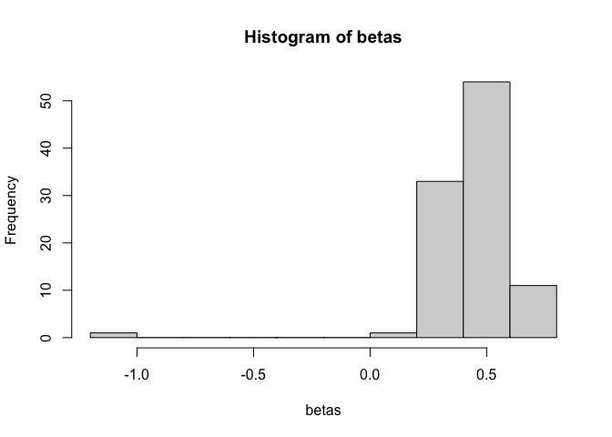

relcs
=====

What is this?
-------------

Random Effects Latent Change Score models.

Install
-------

Obtain the latest package version from github:

    install.packages("devtools")
    devtools::install_github("brandmaier/relcs")

Load the `relcs` library:

    library("relcs")
    #> Loading required package: parallel
    #> Loading required package: MASS
    #> Loading required package: OpenMx
    #> OpenMx may run faster if it is compiled to take advantage of multiple cores.
    #> Loading required package: rstan
    #> Loading required package: StanHeaders
    #> Loading required package: ggplot2
    #> rstan (Version 2.19.3, GitRev: 2e1f913d3ca3)
    #> For execution on a local, multicore CPU with excess RAM we recommend calling
    #> options(mc.cores = parallel::detectCores()).
    #> To avoid recompilation of unchanged Stan programs, we recommend calling
    #> rstan_options(auto_write = TRUE)

How To Use
----------

The `relcs` package offers functions to simulate data (either from an
OpenMx model or from specialized code) and to fit a model using either
STAN or OpenMx.

### Simulation

Simulate 100 cases from a RELCS model:

    library(relcs)
    library(tidyverse)
    library(ggplot2)

    simulated_data <- simulateDataFromRELCS(N = 100, 
                                            num.obs = 5, 
                                            residualerrorvariance = .3,
                                            selffeedback.mean = .5,
                                            selffeedback.variance = .01,
                                            interceptmu = 0,
                                            interceptvariance = 1,
                                            has.slope=FALSE)

Plot the first 20 simulated trajectories:

    simulated_data %>% 
      mutate(id=1:nrow(simulated_data)) %>% 
      filter(id < 20) %>%
      pivot_longer(-id) %>%
      ggplot(aes(x=name,y=value,group=id,color=factor(id)))+
      geom_line()+
      theme_minimal()+
      xlab("Time")+ylab("Value")+
      ggx::gg_("hide legend")
    #> Registered S3 method overwritten by 'sets':
    #>   method        from   
    #>   print.element ggplot2

### model fit

    fit <- fitRELCS(data = simulated_data, type="stan")

    fit$fit
    #> Inference for Stan model: f5c4092c36946657ffd2b8726c04f9d6.
    #> 3 chains, each with iter=600; warmup=200; thin=1; 
    #> post-warmup draws per chain=400, total post-warmup draws=1200.
    #> 
    #>                 mean se_mean    sd   2.5%    25%    50%    75%  97.5% n_eff
    #> residual_var    0.31    0.00  0.02   0.26   0.29   0.31   0.32   0.36   773
    #> self_fb_mu      0.47    0.00  0.02   0.43   0.46   0.47   0.48   0.51   716
    #> self_fb_var     0.02    0.00  0.01   0.01   0.01   0.01   0.02   0.03   301
    #> intercept_mu   -0.02    0.00  0.11  -0.24  -0.09  -0.02   0.05   0.19  1991
    #> intercept_var   1.19    0.00  0.18   0.88   1.06   1.18   1.30   1.57  1440
    #> lp__          146.10    0.94 15.57 115.61 135.77 146.27 156.99 175.49   274
    #>               Rhat
    #> residual_var  1.00
    #> self_fb_mu    1.00
    #> self_fb_var   1.00
    #> intercept_mu  1.00
    #> intercept_var 1.00
    #> lp__          1.01
    #> 
    #> Samples were drawn using NUTS(diag_e) at Thu Mar 25 20:58:47 2021.
    #> For each parameter, n_eff is a crude measure of effective sample size,
    #> and Rhat is the potential scale reduction factor on split chains (at 
    #> convergence, Rhat=1).

### visually inspect model posteriors

    hist(rstan::extract(fit$fit)$residual_var,main = "Residual Variance")

 \#\#\#
Obtain individual beta estimates

Re-fit the model with option `beta.as.parameter` which makes the
person-specific parameters additional parameters, one for each person.

    fit_with_beta <- fitRELCS(data = simulated_data, type="stan",beta.as.parameter = TRUE)
    #> recompiling to avoid crashing R session

Get the beta values from the model and obtain summary.

    betas <- get_beta_estimates(fit_with_beta)
    summary(betas)
    #>    Min. 1st Qu.  Median    Mean 3rd Qu.    Max. 
    #> -1.1540  0.3194  0.4504  0.4202  0.5352  0.7139
    hist(betas)

### inspect STAN code

    cat(fit$code)
    #> 
    #> data{
    #> int N; // sample size
    #> int t; 
    #> vector[t] X[N]; // data matrix of order [N,P]
    #> }
    #> 
    #> parameters{
    #> real residual_var; // error variance for each observation
    #> real<lower=0> self_fb_var; // self-feedback variance (positive)
    #> real self_fb_mu; // self-feedback mean
    #> vector[N] beta; // self-feedbacks for each person
    #> 
    #> real<lower=0> intercept_var;
    #> real intercept_mu; // intercept mean
    #> vector[N] intt;
    #> 
    #> 
    #> }
    #> 
    #> transformed parameters{
    #> 
    #> 
    #> 
    #> vector[t] mu[N];
    #> vector[t-1] d[N];
    #> 
    #> for (i in 1:N){
    #> 
    #> mu[i,1] = intt[i];
    #> 
    #> for (tt in 2:t){
    #> d[i,tt-1] = beta[i]*mu[i,tt-1];
    #> mu[i,tt] = d[i,tt-1]+mu[i,tt-1];
    #> }
    #> }
    #> 
    #> 
    #> 
    #> }
    #> 
    #> model{
    #> intercept_var ~ gamma(.1,2);  // prior for intercept variance
    #> self_fb_var ~ gamma(.1,2);   // prior for self-feedback variance
    #> self_fb_mu ~ normal(0,1);  // prior for self-feedback mean
    #> 
    #> for (i in 1:N){
    #> 
    #>  intt[i] ~ normal(intercept_mu, pow(intercept_var,0.5));
    #>  beta[i] ~ normal(self_fb_mu, pow(self_fb_var,0.5));
    #>  X[i,1] ~ normal(mu[i,1],pow(residual_var,0.5));
    #> 
    #> 
    #>  for (tt in 2:t){
    #>    X[i,tt] ~ normal(mu[i,tt], pow(residual_var,0.5));
    #>  }
    #> 
    #> }
    #> }
